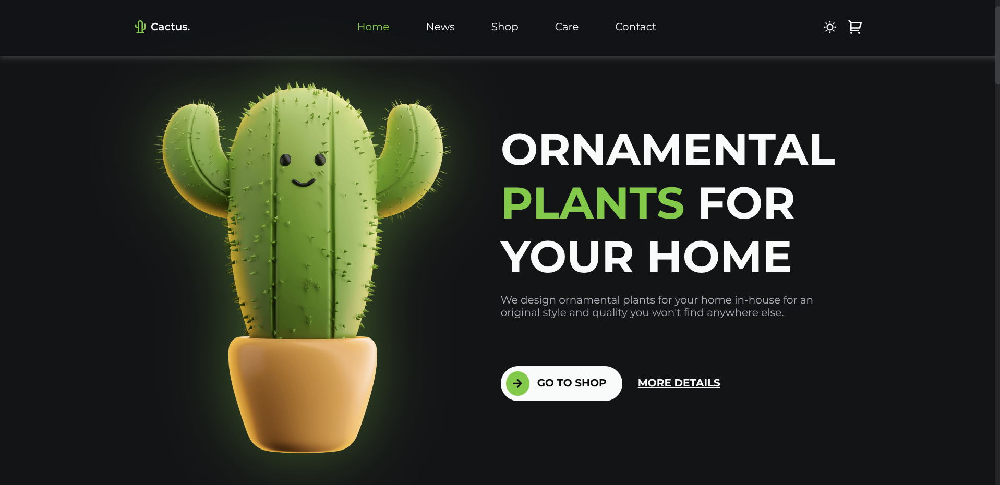

# Cactus

<p align="center">
  
  
</p>

## Overview

A clean, modern front-end project built using **HTML, CSS, and JavaScript**.  
Designed with a focus on smooth interactions, visual clarity, and responsive layout.

## Tech Stack

<p align="center">
  
  
  
</p>

## Getting Started

Simply open the project in your browser:

```bash
# using live server (recommended)
open index.html
```
